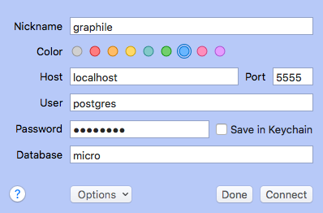

# GraphQL on a SQL DB - Demo

[Postgraphile](https://www.graphile.org/postgraphile/quick-start-guide/) automatically takes a PostgreSQL database and provides a GraphQL server. 

[Hasura](https://hasura.io/) is an open source engine which connects databases and microservices to give you a "production ready" GraphQL API. 

## Get a Postgres DB

Requires docker and npm. In your commandline:

```
# build 
docker build -t db . 

# run
docker run --name crate -p 5555:5432 db
```

This will give you a running PostgreSQL database with some test data. You can view it using a tool like [Postico](https://eggerapps.at/postico/). 




The login credentials will be: 

```
user: postgres
password: postgres
host: localhost
port: 5555
database: micro
```

## POSTGRAPHILE

To run postGraphile in watcher mode:

```
npm i 
npm run connect:watch 
```

This gives us a GraphQL api and Graphiql playground at http://localhost:5000/graphiql. You can select information using queries, such as:

```
# All Candidate info
{
  allCandidates {
    nodes {
      candidatename
      skill
    }
  }
}

# All job titles
{
  allJobs {
    nodes {
      title
    }
  }
}
```

## HASURA

To run Hasura, run the `./docker-run.sh` file. Open the Hasura console at http://localhost:8080/console

You can track Tables & Views through the console, using these instructions: https://docs.hasura.io/1.0/graphql/manual/schema/using-existing-database.html

